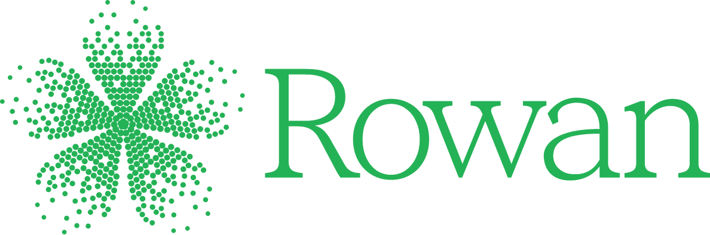

{ width="320" }

# Rowan Python API

The `rowan` package is the official Python client for the [Rowan](https://rowansci.com) computational
chemistry platform. Submit workflows, poll or stream results, and manage
molecules, proteins, folders, and projects—all from plain Python.

## Installation

=== "pip"

    ```bash
    pip install rowan-python
    ```

=== "pixi"

    ```bash
    pixi add --pypi rowan-python
    ```

=== "uv"

    ```bash
    uv add rowan-python
    ```

## Authentication

Create an API key on your [account page](https://labs.rowansci.com/account), then either export
it as an environment variable or set it directly on the module:

```python
import os

os.environ["ROWAN_API_KEY"]  # picked up automatically, or...

import rowan

rowan.api_key = "rowan-sk..."
```

!!! tip "Working in a shared process?"
    Use [`rowan.api_credentials`](api/api-keys.md) to scope a key to a single `with` block instead
    of setting it globally — handy for multi-tenant scripts or test suites.

## Quickstart

This example runs a geometry optimization on isoprene and streams each optimization step as it
completes:

```python title="quickstart.py" linenums="1"
import rowan

folder = rowan.get_folder("examples")  # (1)!

workflow = rowan.submit_basic_calculation_workflow(
    initial_molecule=rowan.Molecule.from_smiles("CC(=C)C=C"),
    preset="rapid_semiempirical",  # (2)!
    tasks=["optimize"],
    name="Isoprene Optimization",
    folder=folder,
)

print(f"View workflow at: https://labs.rowansci.com/calculation/{workflow.uuid}")

for result in workflow.stream_result(poll_interval=3):  # (3)!
    if result.calculation_uuid:
        mols = rowan.retrieve_calculation_molecules(result.calculation_uuid)
        print(f"  {len(mols)} opt steps, energy={mols[-1].get('energy') if mols else None}")

print(result)  # (4)!
```

1. Folders are created on first use — no need to pre-create them in the UI.
2. Presets bundle a method, basis set, and corrections into one named choice. See
   [Basic Calculation](workflows/basic-calculation.md) for the full list and when to use each one.
3. `stream_result` polls the API and yields an updated result after every optimization step,
   instead of blocking until the whole workflow finishes.
4. The final yielded result is the completed workflow — same object you'd get from `workflow.result`
   after `workflow.wait()`.

## What's next

<div class="grid cards" markdown>

-   :material-flask-outline: **Workflows**

    ---

    Every Rowan workflow's submit function, settings, and result type, grouped by molecular
    modeling, property prediction, protein–ligand, spectrometry, and cheminformatics.

    [:octicons-arrow-right-24: Browse workflows](workflows/basic-calculation.md)

-   :material-code-braces: **Objects**

    ---

    `Molecule`, `Protein`, `Folder`, `Project`, `Workflow`, `Calculation`, and the account/API-key
    types every workflow builds on.

    [:octicons-arrow-right-24: Browse objects](api/workflow.md)

</div>
